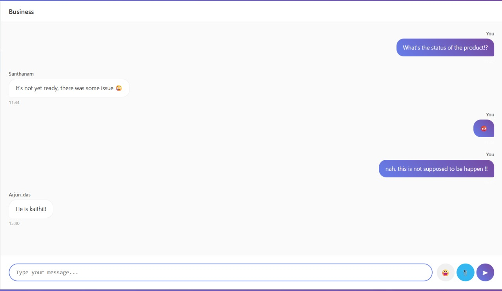

# 🚀 Enhanced Real-Time Chat Application

A modern, feature-rich chat application built for Computer Networks project demonstrating client-server architecture, real-time communication, and web technologies.


## 📋 Table of Contents
- [Features](#-features)
- [Technology Stack](#-technology-stack)
- [Network Architecture](#-network-architecture)
- [Installation & Setup](#-installation--setup)
- [Usage Guide](#-usage-guide)
- [API Endpoints](#-api-endpoints)
- [Database Schema](#-database-schema)
- [File Structure](#-file-structure)
- [Screenshots](#-screenshots)
- [Future Enhancements](#-future-enhancements)
- [Contributing](#-contributing)

## ✨ Features

### 🔐 Authentication System
- **User Registration**: Secure account creation with username validation
- **User Login**: Session-based authentication
- **Password Security**: SHA-256 hashing for password protection
- **Session Management**: Secure logout functionality


### 💬 Real-Time Messaging
- **Multi-Room Support**: Create and join multiple chat rooms
- **Real-Time Updates**: Auto-refresh messages every 3 seconds (HTTP polling)
- **Message Threading**: Organized conversation flow
- **Timestamp Display**: Smart time formatting (today/date)
- **User Identification**: Distinguish between own and other users' messages

### 🎨 Modern User Interface
- **Responsive Design**: Mobile-first approach with breakpoints
- **Gradient Themes**: Beautiful purple gradient color scheme
- **Emoji Support**: Built-in emoji picker with 32+ emojis
- **File Sharing**: Upload and share files with visual icons
- **Auto-Resize Input**: Dynamic textarea expansion
- **Smooth Animations**: Hover effects and transitions

### 📁 File Management
- **File Upload**: Support for multiple file types (images, documents, media)
- **File Type Icons**: Visual representation (📄 PDF, 🖼️ Images, 🎵 Audio, etc.)
- **Size Limits**: 10MB maximum file size
- **Secure Storage**: Files stored in dedicated uploads directory
- **Direct Download**: Click-to-download functionality

### 🏠 Room Management
- **Dynamic Room Creation**: Users can create new chat rooms
- **Room Navigation**: Easy switching between different rooms
- **Default Room**: "General" room created automatically
- **Active Room Indicator**: Visual highlighting of current room

## 🛠 Technology Stack

### Frontend Technologies
- **HTML5**: Semantic markup and structure
- **CSS3**: Advanced styling with Flexbox/Grid, animations, and responsive design
- **JavaScript (ES6+)**: Modern JavaScript with async/await, fetch API
- **Responsive Design**: Mobile-first approach with media queries

### Backend Technologies
- **Python 3.x**: Server-side programming language
- **Flask Framework**: Lightweight web framework for Python
- **SQLite3**: Embedded relational database
- **Session Management**: Flask sessions for user authentication

### Network Protocols & Concepts
- **HTTP/HTTPS**: Request-response communication protocol
- **TCP/IP**: Underlying transport and network layer protocols
- **Client-Server Architecture**: Centralized server handling multiple clients
- **RESTful API**: Resource-based API design
- **Polling Mechanism**: Simulated real-time updates via periodic HTTP requests
- **File Transfer Protocol**: HTTP-based file upload/download

## 🌐 Network Architecture

```
┌─────────────────┐         ┌─────────────────┐
│   Web Browser   │◄────────┤   Flask Server  │
│   (Frontend)    │  HTTP   │   (Backend)     │
│                 │ Requests│                 │
│  - HTML/CSS/JS  │────────►│  - Python/Flask │
│  - User Interface│         │  - SQLite DB    │
│  - HTTP Client  │         │  - File Storage │
└─────────────────┘         └─────────────────┘
        │                           │
        │                           │
        ▼                           ▼
┌─────────────────┐         ┌─────────────────┐
│   Local Storage │         │   Server Storage│
│   - Session Data│         │   - Database    │
│   - UI State    │         │   - Uploaded    │
│                 │         │     Files       │
└─────────────────┘         └─────────────────┘
```

### Communication Flow
1. **Client Initialization**: Browser loads HTML/CSS/JS
2. **Authentication**: POST requests for login/register
3. **Session Management**: Server maintains user sessions
4. **Message Polling**: Periodic GET requests for new messages
5. **Real-time Simulation**: 3-second intervals for message updates
6. **File Transfer**: Multipart form data for file uploads

## 🚀 Installation & Setup

### Prerequisites
- Python 3.7+ installed
- Modern web browser (Chrome, Firefox, Safari, Edge)
- Basic understanding of terminal/command prompt

### Step-by-Step Installation

1. **Clone/Download the Repository**
   ```bash
   git clone https://github.com/yourusername/-chat-app.git
   ```

2. **Install Required Dependencies**
   ```bash
   pip install flask
   # or if you have pip3
   pip3 install flask
   ```

3. **Project Structure Setup**
   ```
   chat-app/
   ├── index.html          # Frontend interface
   ├── server.py          # Backend server
   ├── uploads/           # File storage (auto-created)
   ├── chat_app.db       # SQLite database (auto-created)
   └── README.md         # Documentation
   ```

4. **Run the Application**
   ```bash
   python server.py
   # or
   python3 server.py
   ```

5. **Access the Application**
   - Open your web browser
   - Navigate to: `http://localhost:8000`
   - Start chatting!

### Environment Configuration
- **Host**: 0.0.0.0 (accessible from network)
- **Port**: 8000 (configurable in server.py)
- **Debug Mode**: Enabled for development
- **Secret Key**: Change in production environment

## 📖 Usage Guide

### Getting Started
1. **Registration**: Create new account with username (min 3 chars) and password (min 4 chars)
2. **Login**: Access existing account
3. **Room Selection**: Choose or create a chat room
4. **Start Messaging**: Type and send messages


### Messaging Features
- **Text Messages**: Type in the input area and press Enter or click Send
- **Emoji Integration**: Click 😀 button to open emoji picker
- **File Sharing**: Click 📎 button to upload files
- **Multi-line Messages**: Use Shift+Enter for line breaks

### Room Management
- **Create Room**: Enter room name in sidebar and click "+ Add"
- **Switch Rooms**: Click on any room in the sidebar
- **Room Persistence**: All rooms and messages are saved in database


## 🔌 API Endpoints

### Authentication Endpoints
| Method | Endpoint | Description | Request Body |
|--------|----------|-------------|--------------|
| POST | `/register` | User registration | `{username, password}` |
| POST | `/login` | User login | `{username, password}` |
| POST | `/logout` | User logout | None |
| GET | `/check_auth` | Check authentication status | None |

### Chat Endpoints
| Method | Endpoint | Description | Request Body |
|--------|----------|-------------|--------------|
| GET | `/rooms` | Get all chat rooms | None |
| POST | `/create_room` | Create new room | `{name}` |
| GET | `/messages/<room_id>` | Get room messages | None |
| POST | `/send` | Send message | `{message, room_id}` |

### File Endpoints
| Method | Endpoint | Description | Request Body |
|--------|----------|-------------|--------------|
| POST | `/upload` | Upload file | `multipart/form-data` |
| GET | `/files/<filename>` | Download file | None |

### Response Format
```json
{
  "status": "success|error",
  "message": "Description",
  "data": {} // Optional additional data
}
```

## 🗄 Database Schema

### Users Table
```sql
CREATE TABLE users (
    id INTEGER PRIMARY KEY AUTOINCREMENT,
    username TEXT UNIQUE NOT NULL,
    password TEXT NOT NULL,
    created_at TIMESTAMP DEFAULT CURRENT_TIMESTAMP
);
```

### Rooms Table
```sql
CREATE TABLE rooms (
    id INTEGER PRIMARY KEY AUTOINCREMENT,
    name TEXT UNIQUE NOT NULL,
    created_by INTEGER,
    created_at TIMESTAMP DEFAULT CURRENT_TIMESTAMP,
    FOREIGN KEY (created_by) REFERENCES users (id)
);
```

### Messages Table
```sql
CREATE TABLE messages (
    id INTEGER PRIMARY KEY AUTOINCREMENT,
    username TEXT NOT NULL,
    message TEXT NOT NULL,
    room_id INTEGER NOT NULL,
    timestamp TIMESTAMP DEFAULT CURRENT_TIMESTAMP,
    file_path TEXT,
    message_type TEXT DEFAULT 'text',
    FOREIGN KEY (room_id) REFERENCES rooms (id)
);
```

## 📁 File Structure

```
chat-application/
├── 📄 index.html              # Main frontend file
│   ├── HTML structure
│   ├── CSS styling (embedded)
│   └── JavaScript functionality
├── 🐍 server.py               # Backend Flask server
│   ├── Flask routes
│   ├── Database operations
│   ├── Authentication logic
│   └── File handling
├── 📊 chat_app.db            # SQLite database (auto-generated)
├── 📁 uploads/               # File storage directory
├── 📁 results/               # Screenshots for documentation
│   ├── login_signup.png
│   ├── chat_overview.png
│   ├── chat_interface.png
│   ├── file_sharing.png
│   ├── room_creation.png
│   └── mobile_view.png
└── 📖 README.md              # This documentation
```

## 📱 Screenshots

### Authentication Flow

*User authentication with form validation*

### Main Chat Interface

*Full chat application with sidebar, messages, and input area*

### File Sharing Feature

*File upload and sharing functionality*

### Multi-User Chat

*Multiple users chatting in real-time*

### Room Management

*Creating and managing chat rooms*


## 🔒 Security Features

- **Password Hashing**: SHA-256 encryption for user passwords
- **Session Management**: Secure Flask sessions
- **File Validation**: Allowed file extensions and size limits
- **SQL Injection Prevention**: Parameterized queries
- **XSS Protection**: Input sanitization
- **Secure File Handling**: werkzeug secure_filename

## 🚀 Future Enhancements

### Real-Time Communication
- **WebSocket Integration**: Replace HTTP polling with WebSockets
- **Socket.IO Implementation**: Better real-time experience
- **Push Notifications**: Browser notifications for new messages

### Advanced Features
- **Private Messaging**: Direct user-to-user communication
- **Message Reactions**: Emoji reactions to messages
- **Message Search**: Full-text search across messages
- **User Status**: Online/offline indicators
- **Typing Indicators**: Show when users are typing

### Technical Improvements
- **Database Migration**: PostgreSQL for production
- **Caching Layer**: Redis for better performance
- **Load Balancing**: Multiple server instances
- **CDN Integration**: File storage optimization

## 🤝 Contributing

1. Fork the repository
2. Create a feature branch (`git checkout -b feature/AmazingFeature`)
3. Commit your changes (`git commit -m 'Add some AmazingFeature'`)
4. Push to the branch (`git push origin feature/AmazingFeature`)
5. Open a Pull Request

## 📄 License

This project is licensed under the MIT License - see the [LICENSE](LICENSE) file for details.

## 👨‍💻 Author

**Your Name**
- GitHub: [@Harsha-Vardhan2005](https://github.com/Harsha-Vardhan2005)
- Email: harshacb922@gmail.com

## 🙏 Acknowledgments

- Flask Documentation
- MDN Web Docs for frontend technologies
- SQLite Documentation
- Computer Networks materials

---

### 📊 Project Statistics

- **Frontend**: HTML/CSS/JavaScript
- **Backend**: Python/Flask
- **Database**: SQLite3
- **Features**: 8+ major features
